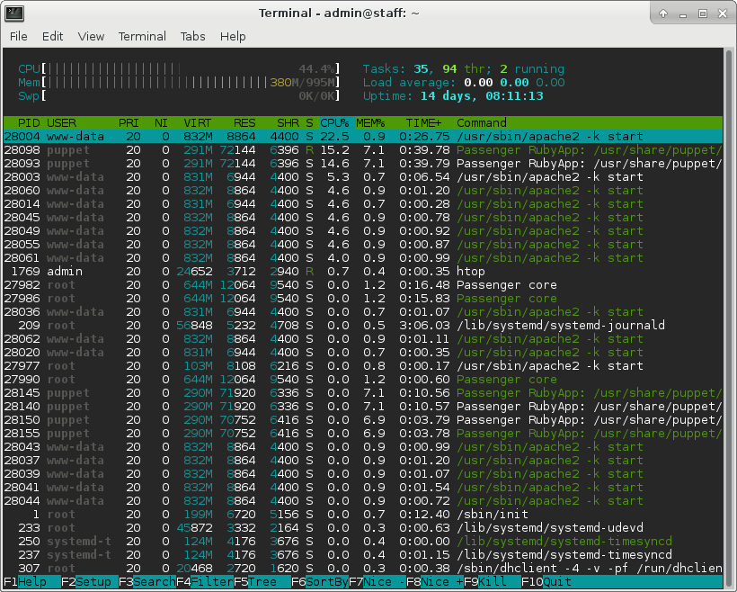

## Overview

At any given time, there are dozens of processes running on a Unix server.
Most of these processes run in the background. Today we'll explore these
background processes and how we can control them.

Make sure you are doing all of these exercises on your VM.


## Which processes are running on my system?

Open up a terminal and run the `ps` command. You should see something like this:

```
  PID TTY          TIME CMD
14195 pts/1    00:00:00 bash
15289 pts/1    00:00:00 ps
```

As you can see, `ps` displays itself in the list. This is because `ps` displays
the processes which are running at the time it runs, which includes itself.

Now run `sleep 100` in the background and then run `ps`. Now you should see
something like:

```
$ sleep 100 &
[1] 7309
$ ps
  PID TTY          TIME CMD
 7047 pts/1    00:00:00 bash
 7309 pts/1    00:00:00 sleep
 7310 pts/1    00:00:00 ps
```

`ps` now displays your `sleep` process running in the background.

Let's take a look at the first column of `ps`'s output in detail. That column
is the PID. Each process on your system has an ID number associated with it.
One thing you can use the PID for is to kill processes. Try killing your sleep
process with `kill 7309`. (Substitute `7309` for whatever PID `ps` printed out
for you.) Then if you hit Enter another time, bash should tell you that the
`sleep` process has been terminated.

By default, `ps` only displays the processes running in your current terminal
session. Try running `ps -e` to see all processes.

You can also run `ps -f` to see the full command line. Try running `ps -f` and
`ps -ef` in your terminal. What do they do?

You can also run `ps -u yourusername` to see the processes currently running
as your user. What do you see?


## htop

Open up a terminal and run the `htop` command. You should see something like
this:



First hit F2, scroll down to Display options, and check Hide userland process
threads. We won't be dealing with those in this lab.

Now press F10 to return to the main screen. Scroll down the list. Each entry in the list is a
process. Are there any processes in the list you recognize? Can you find
`bash` in the list?

Now, open up another terminal window and SSH into your VM. Then run the `yes`
command. The `yes` command prints a continuous stream of `y`'s. Now look at
`htop` again. The `yes` command should be using 100% or more CPU, because it's
running all the time. If you also look at the CPU bars at the top, you can see
how at least one CPU is maxed out.

### The process hierarchy

So now let's try something else. (You can quit `yes` now). In htop, press F5
to display processes as a tree.

You're now looking at the process hierarchy. On Unix, every process has a parent
process, which is initially the process that created it.

Open up a new terminal and SSH into your VM. Then launch `sleep 1000 &` in the
background. Then, in htop, find the sleep process. What is its parent?

Select this parent and press F9 to kill it. A menu titled "Send signal" should
open up on the left, with a list of signals you can send. Send it the signal
`SIGTERM`.  What happens?

If you look, the process you killed should no longer be in the process list.
The `sleep` process should still be around (because you launched it in the
background), and its parent should be PID 1. As you can see, when a process is
orphaned, it is adopted by the init process.

Let's now go over some of those other signals:

 - `SIGTERM`: Terminates the process. The process is given a chance to clean up.
 - `SIGKILL`: Kills the process immediately, without giving it a chance to
   clean up.
 - `SIGINT`: This signal is sent to a process when you are running it in a
   terminal and you press Ctrl+C. (You can, of course, manually send it too.)
   It usually terminates your process, but allows it to print out some final
   messages or similar first.
 - `SIGSTOP`: This signal stops (i.e. pauses) a process.
 - `SIGCONT`: This process resumes a stopped process.
 - `SIGHUP`: This signal is sent to the processes running in your terminal
   session when you close it. It generally kills those processes.

With the exception of `SIGKILL` and `SIGSTOP`, all of these signals can be
_handled_, which means that the receiving process can intercept the signal and
do some custom action with it instead of terminating.


## iotop

Another interesting statistic we can look at is how much I/O activity each of
our processes is causing. Run `sudo iotop`. This should give you a display of
which processes are using the most I/O, sorted from greatest to least.


## Daemons

If you look at your process list in htop, you'll see that most of those
processes are ones you might not recognize, that you never see. These processes
are daemon processes - they run noninteractively in the background.

One of these daemons is cron. It allows you to run tasks at specified times.
Let's make a task that runs every 5 minutes, which prints the current date
into a file. Open up `/etc/crontab` in a text editor as root, and add the line:

    */5 *	* * *	root	date >> /var/log/mycronjob.log

Now, cron will run the `date` command as the root user at the beginning of every
minute divisible by 5. Keep this cronjob around for the checkoff at the end of
the lab.


## Using systemd

### Which services are running right now?

Run `systemctl`. You'll see a long table of every unit known to systemd.

Let's narrow it down to services for now. Run `systemctl --type=service`.
Now you can see a list of all services running on your computer. Each of these
services is a daemon running in the background. Can you see cron in the list?

### Controlling services

Now, let's try controlling services. Install the nginx web server using apt, and
then visit http://_yourvm_.decal.xcf.sh/. You should see a default nginx landing page.

Now, let's make nginx listen on port 8080 instead of port 80. Open up
`/etc/nginx/sites-available/default` and change the following lines:

    listen 80 default_server;
    listen [::]:80 default_server;
    
to:

    listen 8080 default_server;
    listen [::]:8080 default_server;

Now, we need to tell nginx to reload its configuration. Find which unit nginx
is, and reload it.

Now, if you go to http://_yourvm_.decal.xcf.sh/, you should get a connection
refused error, but if you go to http://_yourvm_.decal.xcf.sh:8080/, you should
see the same landing page.

Not all services can be reloaded. Sometimes, you'll need to restart a service.
You can do this using `systemctl restart`. Try running that command on nginx's
unit.

Now let's stop nginx. Run `systemctl stop` on the appropriate unit. You
shouldn't be able to access http://_yourvm_.decal.xcf.sh:8080/ anymore. If you
start up nginx again with `systemctl start`, then you should be able to access
that page again.

### Setting up a new service

Let's set up a new service and write a systemd unit for it.

Follow these instructions to get the code for the toy service:

1. Download the [code](lab6/toy.tar.xz) onto your VM. You can use the `wget` or
   `curl` commands for this.
2. Extract said code with `tar -xJf toy.tar.xz` into your home directory.
3. `cd` into the `toy` directory.
4. Run `make`.

Now run `./run`. This should start up a simple web app at
http://_yourvm_.decal.xcf.sh:5000/.

Your goal is to make this web app into a systemd service. To do this, make a new
unit file at `/etc/systemd/system/toy.service`. Fill the unit file with at least
the following fields. Refer to the slides for an example. DigitalOcean also has
a [good guide](https://www.digitalocean.com/community/tutorials/understanding-systemd-units-and-unit-files)
on how to write systemd units.

 - Description: give it a short description of what this is
 - Requires and After: which units might we want our toy service to wait for
   to first be loaded. (Hint: it has to wait for the network to be online.)
 - ExecStart: which script are we trying to run?
 - WantedBy: at which stage of the booting process should this service be
   launched?

You might also want to fill out the following fields:

 - Restart: if the webapp crashes, should we try to restart it?
 - User: which user should the webapp run as? Perhaps not as root...

Feel free to experiment with other fields as suits your liking.

Once you've got your unit file ready, refresh systemd, enable, and start your
unit:

    # systemctl daemon-reload
    # systemctl enable foo
    # systemctl start foo

Use `systemctl status` to check that foo.service didn't crash. If it didn't, you
should be able to go to http://_yourvm_.decal.xcf.sh:5000/ and access it there.

### Debugging services

Every once in a while, some daemon will go awry, and as a sysadmin, you'll have
to fix it.

There's an Apache installation on your VM, but it's broken for some reason. It's
supposed to display something at http://_yourvm_.decal.xcf.sh:8000/, but Apache
isn't starting.  Try using the `journalctl` command to figure out what's going
wrong. (You can use the `-u` option to restrict the output to only one unit.)
Once you find the error, fix it and restart Apache.

While some errors are logged by `journalctl`, not all of them are. Try going to
http://_yourvm_.decal.xcf.sh:8000/ again. You'll see a 403 Forbidden message
where you're supposed to see a nice website. Something else must be wrong. Try
looking through the Apache error logs to see what the problem is and correct
it. (Why don't you start by finding out where the Apache error logs are?)


## Exploration

This is just the tip of the iceberg when it comes to processes and services.
If you would like to learn more, here are some topics you can check out:

 - Wikipedia's article on [init systems](https://en.wikipedia.org/wiki/Init)
 - [Construction of a basic init system](https://felipec.wordpress.com/2013/11/04/init/)
 - [The systemd unit manpage](https://www.freedesktop.org/software/systemd/man/systemd.unit.html):
   everything you ever wanted to know about systemd units
 - [Socket activation](http://0pointer.de/blog/projects/socket-activated-containers.html)
 - Systemd has been the source of a considerable amount of controversy.
   [Opponents](http://www.without-systemd.org/) allege that it violates the
   Unix philosophy of "do one thing and do it well", and that it has had too
   much scope creep, among other complaints.
 - Everything you wanted to know about Unix
   [threads, processes, process groups and sessions](https://www.win.tue.nl/~aeb/linux/lk/lk-10.html).
   Bear in mind that this document is a little dated when it comes to the code
   about threads, and its description of what happens when a pseudotty is closed
   is not actually correct.
