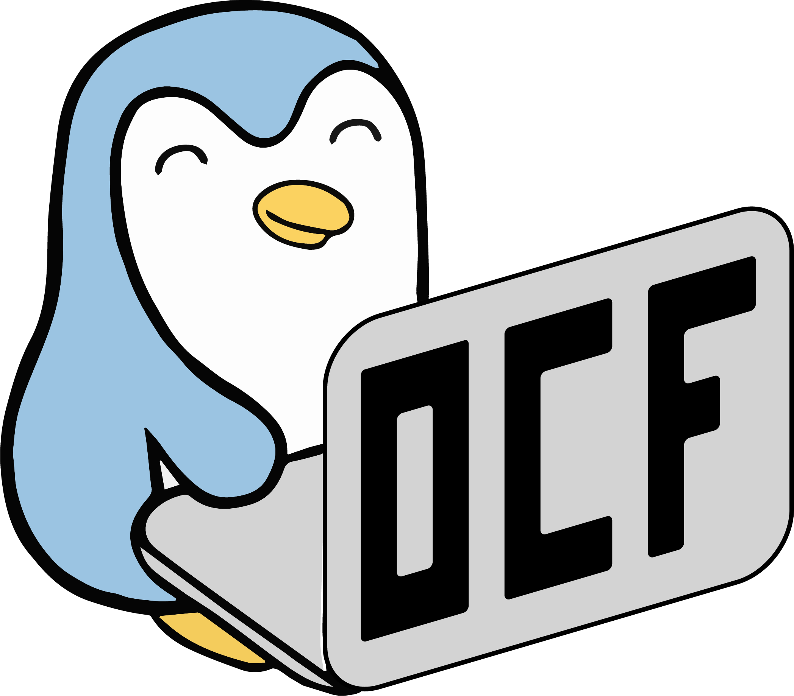
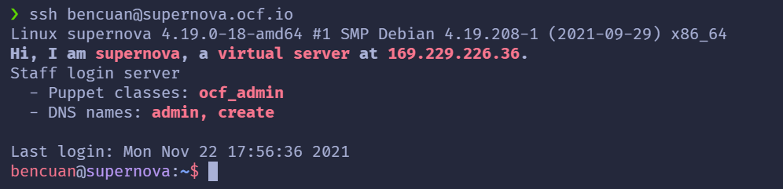

## Table of contents
{: .no_toc .text-delta }

1. TOC
{:toc}

---

## Introduction

Welcome to OCF staff!

These staff training activities are meant to help you get familiarized with the inner workings of the OCF, and feel comfortable contributing to the OCF yourself (whether that be technically, administratively, or both)! All new, veteran, and aspiring staffers are welcome to participate in as much or as little as desired throughout the semester, but we encourage you to come every week even if it's just to hang out with us!

### What will we do in these staff trainings?
The purpose of these training labs are to cover the most useful aspects of OCF infrastructure and organization that staffers actively contribute to or interact with on a day-to-day basis. This includes:
* how to access and interact with important OCF services/servers like tsunami, supernova, puppet, webhosting, docs, ocf-web, HPC, etc.
* an overview of OCF hardware, and how to request shiny new stuff on the buysheet
* what committees are and how to get involved with them
* the RT system, and how to run staff hours
* common tools used in the OCF like Git, vim, and useful terminal commands
* kubernetes, if interest and time allows
* lots of excuses to meet other staffers and make new friends!

You **do not** need any prior experience in anything at all to participate. Concurrent enrollment in the [OCF DeCal](https://decal.ocf.berkeley.edu/) (either beginner or advanced track is ok) is encouraged for new staff.

### Getting Help
Even if you're feeling the slightest bit unsure about something, or if you're curious and want to learn more, don't hesitate to talk to other staff members! We're usually in the lab after-hours (around 8-10pm most days), or during scheduled [staff hours](https://www.ocf.berkeley.edu/staff-hours). If you can't make it to the lab during these times, feel free to post to the following Discord/Slack channels:
* #rebuild: technical and infrastructure-related discussion
* #administrivia: administrative discussion
* #decal-comm: discussion specific to decal and staff training content

### Who to Talk To
If you want to ask someone about something, or just want to say hi, here's a list of some veteran staff members and what they do. **If you'd like to add yourself to this list, make a PR to decal-web and/or ping @bencuan!**

This list was last updated Fall 2022. If it is not currently Fall 2022, please ask a staff member to edit this lab.

General Managers (GMs): oversee the administrative side of the OCF, including BoD meetings. Ask them about hosting staff hours, contributing non-technically, and joining the Board of Directors!
* Nikhil Jha (njha)
* Justin Zhang (jyxzhang)

Site Managers (SMs): oversee the technical side of the OCF, including the lab space. Ask them about OCF infrastructure, technical projects, and upcoming lab upgrades!
* Jonathan Zhang (rjz)
* Ethan Wu (etw)

Operations Managers (OMs): oversee the OCF's operations staff (opstaff), who run the front desk and many other lab operations, including technical and design projects.
* Rameesha Muhammad (rameesha)

Internal Committee (#internal-comm): manages staff events, socials, and meetings.
* Kian Sutarwala (kian)
* Bryan Li (bryli)
* Ben Cuan (bencuan)

External Committee (#external-comm): manages industry, alumni, and club relations.
* Andrei Dones (anddone)

Finance Committee (#finance-comm): manages the OCF budget, purchases, and funding from ABSA, STF, and other sources.
* Saurabh Narain (snarain)
* Ben Cuan (bencuan)

DeCal Committee (#decal-comm): runs the Decal and staff workshops.
* Lance Mathias (lmathias)
* Laksith (laksith)
* Ishaan Dham (idham)

## Task 1: Getting Started

If this is your first time at a staff meeting, we'll need to add you to staff so that you can access resources for contributing!

Before proceeding, **make sure you have an OCF account** ([ocf.io/join](https://ocf.io/join)). This is different from your CalNet account.

Once you have an OCF account, talk to someone with root access (such as the SM's or GM's) who will be able to add you to the staff role.

To verify that you have been added successfully, log in to any OCF desktop using your OCF account credentials. Then, open up a terminal (using ctrl+alt+T or by clicking the icon on the taskbar) and type in `ssh supernova`. It should look something like this:

You can access supernova at any time on other machines (including your own) by typing in `ssh <YOUR_USERNAME>@supernova.ocf.io` on your terminal. If prompted for a password, it's ok if nothing shows up when you type- just hit enter after typing in your password and it will go through.

We'll explore what ssh actually does, as well as some cool things you can do on supernova, in next week's staff training!

## Task 2: Slide into our DM's

Outside of the lab, most of our communication happens over the OCF chat network, which consists of [Discord](https://ocf.io/discord), [Slack](https://ocf.io/slack), [IRC](https://ocf.io/irc), and [Matrix](https://ocf.io/matrix). All of these are bridged, meaning that sending a message in one platform sends it to all of the other platforms too, so pick your favorite one and click on its link to join!

Most staff are currently active on Discord, so if you don't have any prior preferences then we recommend you join it so you can reach other staff more easily through DM's.

### Discord Instructions

If you're joining on Discord, you must first verify your account (instructions on the #verify channel).

Once you're verified, send a message to the #introduce-yourself channel so we can get to know you a little better! Once you do so, you'll receive the newstaff and ocf roles.

You should then be able to add yourself to whatever topic-specific roles you desire (such as for committees or groups), so you can get pinged for any action happening in those areas. It's also recommended to turn notifications on for any channels of interest, as committees/groups usually have their own meeting times outside of general meetings that you won't want to miss.

### Slack Instructions

If you're joining Slack, you will need to create an account using your OCF account email (username@ocf.berkeley.edu). The confirmation email should then be forwarded to your berkeley.edu email address.

Once you join, you'll need to manually add the channels you're interested in. A good way to do so is click the "+" button when hovering over Channels, then sort by most members and go down the list from there.

### IRC/Matrix Instructions

Post on #rebuild if you run into any issues or have any questions about getting set up.

## Conclusion

That's about it for this week! This is the first time we're trying these staff training activities, so if you ever have any feedback or ideas on how to improve them, please [create an issue](https://github.com/0xcf/decal-web/issues) or [make a PR](https://github.com/0xcf/decal-web/pulls) to decal-web! The source files can be found in the [labs folder](https://github.com/0xcf/decal-web/tree/master/labs) and start with the 's' prefix.
