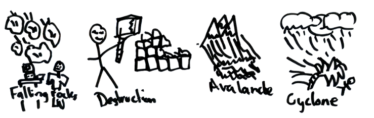

## Table of contents
{: .no_toc .text-delta }

1. TOC
{:toc}

---

## Introduction

Welcome back to the second week of staff training!

This time, we will take a whirlwind tour of some of the cool things we have around the lab, and get you comfortable working with them through the command line. 

The exercises below are best when done after completing the [Shell Spelunking portion of Decal Lab b1](https://decal.ocf.berkeley.edu/labs/b1/#shell-spelunking). If you are not enrolled in the Decal and would like access to the Gradescope to save your answers, please ask a [facilitator](https://decal.ocf.berkeley.edu/staff/) to add you (at least one should be in the lab if you're here in person), or send a message in #decal-comm.

**You are encouraged (and, in some instances, practically required) to use all external resources at your disposal, including Google, [OCF documentation](https://new.ocf.io/docs), and other staff members, to complete any portion of this and future labs.** Doing so is not cheating, and you should keep using them for any contributions you make to the OCF.

## The OCF Servers

Most of our services reside in some form or another on physical hardware inside the OCF lab. **You can see a full list of servers at [ocf.io/servers](https://www.ocf.berkeley.edu/docs/staff/backend/servers/).** 

Here's a quick terminology guide:
* **Physical Servers and Desktops**, including the NUC and Raspberry Pi, are bare-metal hardware that exists in the lab. Ask a GM/SM to give you a tour of the server room!
* **Hypervisors** are software that resides directly on the physical servers. They can manage and contain multiple virtual machines (see below).
* **Virtual Machines** are self-contained operating systems that can be used and connected to as if they were individual computers. Being able to run a large number of virtual machines on a single hypervisor is really useful for a variety of reasons (e.g. easier to maintain, more flexible, needs less physical space in the server room, and so on).

## RTFM! (Scavenger Hunt)

You will need [the OCF documentation](https://new.ocf.io/docs) to complete the following exercises. Try to get as far as you can, but don't be afraid to ask for help if you've been digging for a while and still can't find anything!

The following tasks will need to be completed on an OCF desktop, possibly SSH'ed into supernova (`ssh supernova` when logged into a desktop).

### Task 1
If you've been (or are) in the lab, you've probably seen the TV in the middle of the room. This TV is actually displaying output from an Intel NUC behind it (`tornado`), and you can connect to it and change what it's showing.

Figure out how to open a remote desktop connection to `tornado` from an OCF desktop, open up a new tab, and show a cute cat picture on the TV!

**Notes:**
* While you could theoretically do this with `ssh tornado`, this is not the intended solution.
* You are welcome to mess around on the TV after-hours, but please do not do this when the lab is open to the public!

### Task 2
One of the more popular services the OCF offers is free printing. We have a 200-page-per-semester quota to make sure we don't get bankrupted by toner purchases. However, there is a way to change this quota on an individual account level (this is often used when a print job fails and we need to refund the pages so they can try again).

Find a way to give yourself 200 additional pages this semester!

**Notes:**
* The unofficial policy for staff printing quotas is 'if you can figure out a way to give yourself unlimited pages, you are allowed unlimited pages'. That being said, do be reasonable with your newfound privilege, and if anyone asks you how to do it, redirect them here instead of giving them the answer :)
* If you gave yourself too many pages and are starting to feel guilty, as a bonus exercise you can try to figure out how to subtract pages from your account as well.

### Task 3
If you participate in staff hours, you may get representatives coming in to ask questions about their organization's status in the OCF system. Before helping them with anything sensitive (like changing their password or creating an account), we usually like to verify that they are actually who they say they are, and that they have signatory privileges. (A signatory is someone who can make administrative decisions, work with the university/ASUC, and enforce policies on behalf of a student organization.)

As a test query, figure out who the signatories are for the OCF itself!

**Notes:**
* You should be able to do this with a single command! Try searching for it in the documentation.
* You may need to try a few different queries since the listed name may not match commonly used names (such as 'CSM' vs 'Computer Science Mentors').

### Task 4
The OCF hosts open-source software mirrors-- if you ever downloaded a Linux distribution like Ubuntu, Arch, or Debian, there is a chance you were downloading it directly from OCF servers!

Let's say that you want to install Arch Linux on a new machine via the command line. The first step would be to download the disk image-- figure out how you can manually fetch it from the OCF mirrors.

**Notes:**
* You are looking for the latest `.iso` file. It may help to navigate to the mirror site through your browser before attempting to fetch it on the command line.
* The `wget` command will be useful.
* You don't actually need to download it if you don't want to, since the ISO is >800MB.
* i use arch btw

### Task 5
If you've messed around with your own computer, you've likely found out that it somewhere between 4 and 64GB of RAM. The typical server has far more. But how much exactly?

Find the server/hypervisor(s) with the largest amount of RAM. How much does it have?

**Notes:**
* One way to do this is to first find a way to see all of the server RAM usage, and deduce which ones likely have the most RAM installed. (hint: grafana)
* You may need to Google how to get the RAM usage in Linux. 
* You may also need to SSH into the server before checking its RAM usage.
